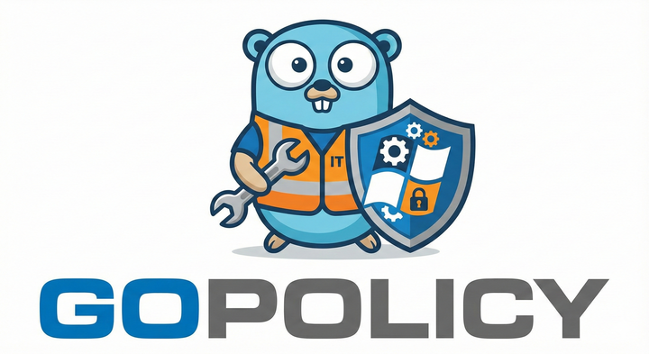
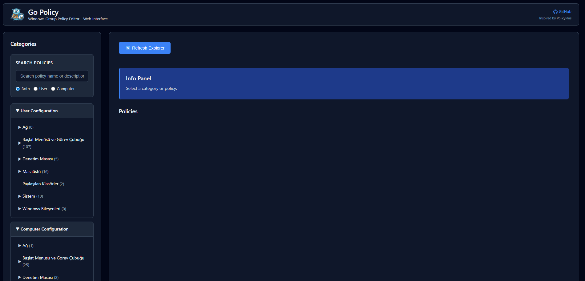
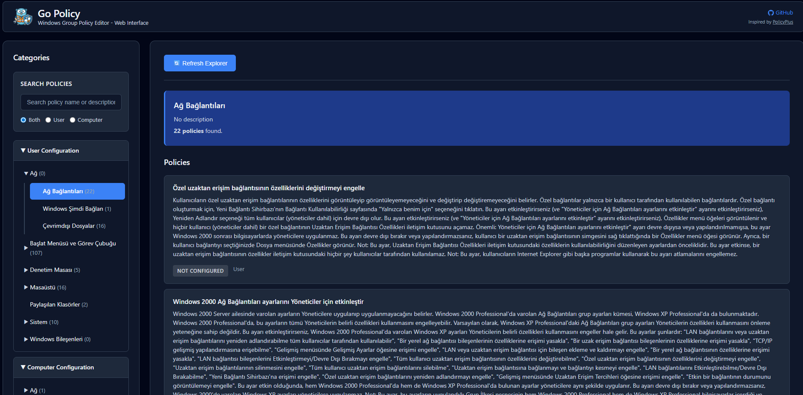
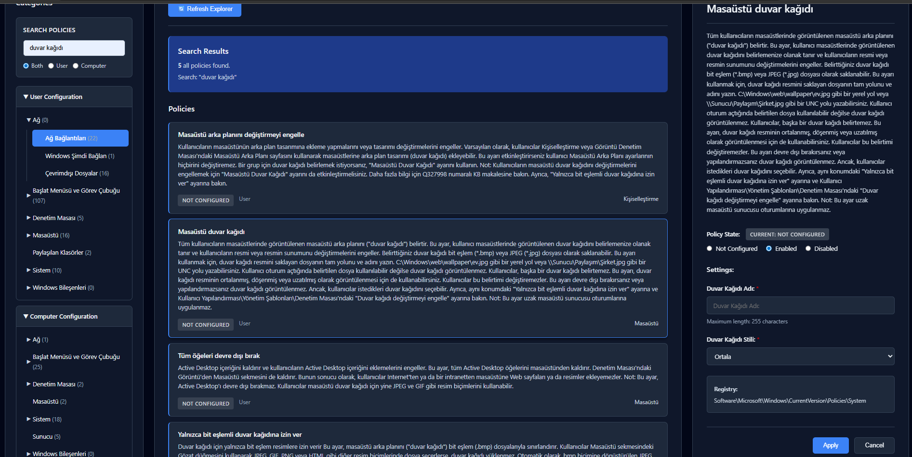

<div align="center">



# Go Policy

**Windows Group Policy Editor - Web-Based Interface for All Windows Versions**

[](https://golang.org/)
[](LICENSE)
[](https://www.microsoft.com/windows)

[Features](#-features) • [Installation](#-installation) • [Usage](#-usage) • [API Documentation](#-api-documentation) • [Contributing](#-contributing)

</div>

---

## 📖 About

**Go Policy** is a modern, web-based Windows Group Policy Editor written in Go. This project is inspired by the original [PolicyPlus](https://github.com/Fleex255/PolicyPlus) project, which was written in Visual Basic .NET. Go Policy provides the same powerful functionality with a modern web interface, making it accessible from any browser.

### Inspiration

This project is inspired by and based on the excellent work done in [PolicyPlus](https://github.com/Fleex255/PolicyPlus) by Fleex255. The original PolicyPlus project demonstrated how to work with Windows Group Policy settings without requiring the full Group Policy infrastructure, making it accessible on all Windows editions including Home versions.

Go Policy takes this concept further by:
- **Rewriting the core logic in Go** for better performance and cross-platform potential
- **Adding a modern web interface** for easier access and better user experience
- **Maintaining full compatibility** with Windows Group Policy structures (ADMX/ADML files)
- **Providing RESTful API endpoints** for programmatic access

### Key Differences from PolicyPlus

While PolicyPlus is a desktop application, Go Policy is a web-based solution that:
- Runs as a local web server
- Can be accessed from any device on your network
- Provides a REST API for automation
- Uses modern web technologies for a responsive UI

> **Note:** Policy descriptions and explanations will appear in your device's language based on the ADML (Administrative Template Language) files available on your system. The interface automatically detects and uses the appropriate language files.

---

## ✨ Features

- ✅ **Works on all Windows versions** (Home, Pro, Enterprise, Server)
- 🌐 **Modern web-based interface** - Access from any browser
- 📝 **Full ADMX/ADML support** - Reads all Windows policy definitions
- 💾 **Registry-based policy management** - Direct registry manipulation
- 🔍 **Advanced search** - Find policies by name or description
- 🎨 **Dark mode UI** - Modern, professional design
- 🚀 **Fast and lightweight** - Built with Go for optimal performance
- 🔄 **Explorer refresh** - Restart Windows Explorer with one click
- 📱 **Responsive design** - Works on desktop and tablet devices
- 🌍 **Multi-language support** - Policy descriptions in your system language

---

## 🎯 Main Goals

1. **Universal Access**: Works on all Windows versions including Home editions
2. **License Compliance**: No Windows components shipped, uses system files
3. **Full-Featured**: Complete Group Policy management capabilities
4. **Easy to Use**: Intuitive web interface accessible from any browser
5. **Developer Friendly**: RESTful API for automation and integration

---

## 📦 Installation

### Requirements

- **Go 1.21 or higher** (for building from source)
- **Windows Vista or higher** (Windows Server 2008+ supported)
- **Web browser** (Chrome, Firefox, Edge, Safari, etc.)
- **Administrator privileges** (required for policy changes)

### Quick Start (Binary)

1. Download the latest release from the [Releases page](https://github.com/SadikSunbul/GoPolicy/releases)
2. Extract the executable
3. Run `gopolicy.exe` (or `gopolicy` on other platforms)
   - Default port (8080): `gopolicy.exe`
   - Custom port: `gopolicy.exe -p 9000`
4. Open your browser and navigate to `http://localhost:8080` (or your custom port)
5. **Important:** For policy changes, run as Administrator (right-click → Run as administrator)

### Build from Source

```bash
# Clone the repository
git clone https://github.com/SadikSunbul/GoPolicy.git
cd GoPolicy

# Install dependencies
go mod download

# Build the application
go build -o gopolicy.exe

# Run the application
# Default port (8080)
./gopolicy.exe

# Or specify a custom port
./gopolicy.exe -p 9000
```

### Command Line Options

- `-p <port>`: Specify the port number (default: 8080)
  - Example: `gopolicy.exe -p 9000` runs on port 9000
  - Example: `gopolicy.exe` runs on default port 8080

---

## 🚀 Usage

### Starting the Application

When you start Go Policy, you'll see output like this:

```
Policy Plus - Go Edition
Local Group Policy Editor for all Windows editions
========================================
Loading ADMX files: C:\Windows\PolicyDefinitions
Detected locales: [en-US, tr-TR]
Starting web interface: http://localhost:8080
Open in your browser and start using!
```

### Using the Web Interface

1. **Open the Web Interface**
   - Navigate to `http://localhost:8080` in your browser
   - The interface will load with all available policy categories

2. **Browse Categories**
   - Use the left sidebar to navigate through policy categories
   - Categories are organized by User Configuration and Computer Configuration
   - Click on a category to see its policies

3. **Search Policies**
   - Use the search box in the sidebar to find policies by name or description
   - Filter by User, Computer, or Both sections
   - Search results appear in real-time

4. **View and Edit Policies**
   - Click on a policy from the list to view its details in the right panel
   - Configure the policy state: Enabled, Disabled, or Not Configured
   - Set policy-specific values if the policy has configurable elements
   - Click "Apply" to save your changes

5. **Refresh Explorer**
   - After making policy changes, click "Refresh Explorer" to restart Windows Explorer
   - This ensures some policy changes take effect immediately

### Example Screenshots


*Main interface showing categories and policy list*


*Policy configuration panel with settings*


*Search functionality with filtered results*

---

## 🔧 API Documentation

Go Policy provides a RESTful API for programmatic access. All API endpoints return JSON responses.

### Base URL

```
http://localhost:8080
```

### Endpoints

#### 1. Get Main Page

```http
GET /
```

Returns the main HTML page of the web interface.

**Response:** HTML content

---

#### 2. List Categories

```http
GET /api/categories
```

Retrieves all policy categories organized by User and Computer configurations.

**Response:**
```json
{
  "user": [
    {
      "id": "category-id",
      "name": "Category Name",
      "description": "Category description",
      "policyCount": 10,
      "children": [...]
    }
  ],
  "computer": [...]
}
```

**Usage Example:**
```bash
curl http://localhost:8080/api/categories
```

---

#### 3. List Policies

```http
GET /api/policies?category={categoryId}
```

Retrieves all policies in a specific category.

**Parameters:**
- `category` (required): The category ID

**Response:**
```json
[
  {
    "id": "policy-id",
    "name": "Policy Name",
    "description": "Policy description",
    "state": "Not Configured",
    "section": "User"
  }
]
```

**Usage Example:**
```bash
curl "http://localhost:8080/api/policies?category=NetworkConnections"
```

---

#### 4. Get Policy Details

```http
GET /api/policy/{policyId}
```

Retrieves detailed information about a specific policy, including its current state and configurable elements.

**Parameters:**
- `policyId` (path): The policy ID

**Response:**
```json
{
  "id": "policy-id",
  "name": "Policy Name",
  "description": "Detailed policy description",
  "state": "Enabled",
  "section": "User",
  "registryKey": "Software\\Policies\\Microsoft\\Windows\\...",
  "elements": [
    {
      "id": "element-id",
      "type": "text",
      "label": "Element Label",
      "description": "Element description",
      "required": false,
      "defaultValue": "default value"
    }
  ]
}
```

**Usage Example:**
```bash
curl http://localhost:8080/api/policy/NC_AllowAdvancedTCPIPConfig
```

---

#### 5. Set Policy State

```http
POST /api/policy/set
Content-Type: application/json
```

Applies a policy configuration to the system.

**Request Body:**
```json
{
  "policyId": "policy-id",
  "state": "Enabled",
  "section": "user",
  "options": {
    "element-id": "value"
  }
}
```

**Parameters:**
- `policyId` (required): The policy ID
- `state` (required): One of `Enabled`, `Disabled`, or `NotConfigured`
- `section` (optional): `user` or `machine` (defaults based on policy)
- `options` (optional): Object containing element values for the policy

**Response:**
```json
{
  "success": true,
  "message": "Policy updated successfully",
  "verifiedState": "Enabled"
}
```

**Usage Example:**
```bash
curl -X POST http://localhost:8080/api/policy/set \
  -H "Content-Type: application/json" \
  -d '{
    "policyId": "NC_AllowAdvancedTCPIPConfig",
    "state": "Enabled",
    "section": "user"
  }'
```

---

#### 6. Search Policies

```http
GET /api/search?q={query}&section={section}
```

Searches for policies by name or description.

**Parameters:**
- `q` (required): Search query
- `section` (optional): `user`, `computer`, or `both` (default: `both`)

**Response:**
```json
{
  "query": "search term",
  "user": [
    {
      "id": "policy-id",
      "name": "Policy Name",
      "description": "Description",
      "state": "Not Configured",
      "section": "User",
      "categoryId": "category-id",
      "categoryName": "Category Name"
    }
  ],
  "computer": [...],
  "total": 5
}
```

**Usage Example:**
```bash
curl "http://localhost:8080/api/search?q=network&section=both"
```

---

#### 7. List Policy Sources

```http
GET /api/sources
```

Retrieves available policy sources (Registry, Local GPO, etc.).

**Response:**
```json
[
  {
    "type": "Local GPO",
    "path": "C:\\Windows\\System32\\GroupPolicy",
    "writable": true
  },
  {
    "type": "Registry",
    "path": "HKLM",
    "writable": true
  }
]
```

**Usage Example:**
```bash
curl http://localhost:8080/api/sources
```

---

#### 8. Save Policies

```http
POST /api/save
```

Saves all pending policy changes to disk (for POL file-based sources).

**Response:**
```json
{
  "success": true,
  "message": "Changes saved"
}
```

**Usage Example:**
```bash
curl -X POST http://localhost:8080/api/save
```

---

#### 9. Refresh Windows Explorer

```http
POST /api/refresh-explorer
```

Restarts Windows Explorer to apply policy changes that require a shell restart.

**Response:**
```json
{
  "success": true,
  "message": "Windows Explorer restarted successfully"
}
```

**Usage Example:**
```bash
curl -X POST http://localhost:8080/api/refresh-explorer
```

**Note:** This endpoint requires administrator privileges.

---

### Error Responses

All API endpoints may return error responses in the following format:

```json
{
  "error": "Error message description"
}
```

Common HTTP status codes:
- `200 OK` - Request successful
- `400 Bad Request` - Invalid request parameters
- `404 Not Found` - Resource not found
- `405 Method Not Allowed` - Invalid HTTP method
- `500 Internal Server Error` - Server error

---

## 🎨 Customization

### Change Port

Edit `main.go` and modify the port variable:

```go
port := ":8080"  // Change to your desired port
```

### Change ADMX Folder

By default, Go Policy uses `C:\Windows\PolicyDefinitions`. To use a custom folder:

```go
admxPath := "C:\\YourCustomPath\\PolicyDefinitions"
```

### Customize UI

- **Colors**: Edit CSS variables in `web/static/style.css`
- **Layout**: Modify `internal/handlers/templates/index.gohtml`
- **Behavior**: Update `web/static/app.js`

---

## 🐛 Troubleshooting

### ADMX Files Cannot Be Loaded

**Problem:** Policies don't appear or categories are empty.

**Solution:**
1. Verify ADMX files exist in `C:\Windows\PolicyDefinitions`
2. On Windows Home editions, download ADMX files from [Microsoft](https://www.microsoft.com/en-us/download/details.aspx?id=104593)
3. Extract to `C:\Windows\PolicyDefinitions` folder

### Port Already in Use

**Problem:** Application fails to start with port error.

**Solution:**
- Change the port in `main.go`
- Or close the application using port 8080

### Access Denied Errors

**Problem:** Policy changes fail with access denied.

**Solution:**
- **Run as Administrator** - Right-click the executable and select "Run as administrator"
- Some policy changes require elevated privileges
- **Note:** Even when compiled to an .exe file, administrator privileges are still required for registry write operations. This is a Windows security requirement, not a limitation of the application.

### Policies Not Taking Effect

**Problem:** Changes are saved but don't apply.

**Solution:**
1. Click "Refresh Explorer" button
2. Log off and log back in
3. Restart your computer for some policies
4. Run `gpupdate /force` in Command Prompt as administrator

### Language/Translation Issues

**Problem:** Policy descriptions appear in wrong language.

**Solution:**
- Go Policy uses ADML files from your system
- Ensure your system has the correct language pack installed
- ADML files should be in `C:\Windows\PolicyDefinitions\{locale}`

---

## 🤝 Contributing

We welcome contributions! Here's how you can help:

### How to Contribute

1. **Fork the Repository**
   ```bash
   # Click the "Fork" button on GitHub
   ```

2. **Create a Feature Branch**
   ```bash
   git checkout -b feature/your-feature-name
   ```

3. **Make Your Changes**
   - Write clean, documented code
   - Follow Go coding conventions
   - Add tests if applicable
   - Update documentation

4. **Commit Your Changes**
   ```bash
   git commit -m "Add: Description of your feature"
   ```

5. **Push to Your Fork**
   ```bash
   git push origin feature/your-feature-name
   ```

6. **Open a Pull Request**
   - Go to the original repository on GitHub
   - Click "New Pull Request"
   - Select your branch
   - Describe your changes

### Contribution Guidelines

- **Code Style**: Follow standard Go formatting (`go fmt`)
- **Documentation**: Update README.md and code comments
- **Testing**: Test your changes on Windows
- **Issues**: Reference related issues in your PR
- **Commits**: Write clear, descriptive commit messages

### Areas for Contribution

- 🐛 **Bug Fixes**: Fix issues reported in the issue tracker
- ✨ **New Features**: Add requested features
- 📚 **Documentation**: Improve documentation and examples
- 🎨 **UI/UX**: Enhance the web interface
- ⚡ **Performance**: Optimize code and improve speed
- 🌍 **Localization**: Add support for more languages
- 🧪 **Testing**: Add unit tests and integration tests

### Reporting Issues

When reporting issues, please include:
- Windows version
- Go version (if building from source)
- Steps to reproduce
- Expected vs actual behavior
- Screenshots (if applicable)
- Error messages

---

## 📄 License

This project is licensed under the MIT License - see the [LICENSE](LICENSE) file for details.

---

## 🙏 Acknowledgments

- **Original PolicyPlus Project**: [Fleex255/PolicyPlus](https://github.com/Fleex255/PolicyPlus)
  - This project is inspired by and based on the excellent work done by Fleex255
  - PolicyPlus demonstrated how to work with Windows Group Policy without full infrastructure
  - Go Policy adapts these concepts to a modern web-based architecture

- **Go Community**: For the excellent tools and libraries
- **Contributors**: Everyone who has helped improve this project

---

## 📞 Support & Contact

- 🐛 **Bug Reports**: [GitHub Issues](https://github.com/SadikSunbul/GoPolicy/issues)
- 💡 **Feature Requests**: [GitHub Discussions](https://github.com/SadikSunbul/GoPolicy/discussions)
- 📧 **Email**: [Your email if you want to share]
- 🌐 **Website**: [Your website if you have one]

---

## ⭐ Star History

If you find this project useful, please consider giving it a star on GitHub!

---

<div align="center">

**⭐ If you liked this project, don't forget to give it a star! ⭐**

Made with ❤️ using Go

[⬆ Back to Top](#-go-policy)

</div>
